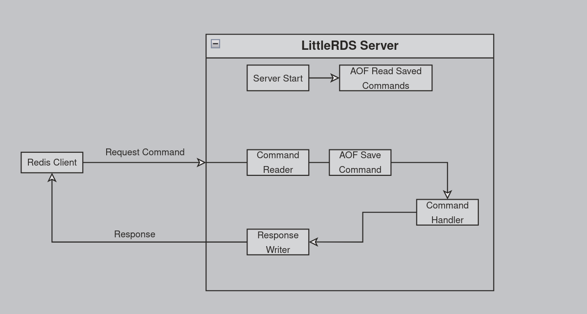

# LittleRDS
A simple key/value database in memory based on Redis

# How does it work?
## Build
You just need to have .NET SDK 7 and Redis CLI.
Some commands to build and run:
1. Need to write in your favorite CLI `dotnet build`
2. And `dotnet run` to run :D

## Connection
Redis CLI (Client)  could be used to communicate with LittleRDS (Server).
You should connect to LittleRDS with this command `redis-cli -h 127.0.0.1 -p 6643`, after that you can start sending commands to the server.

## Commands
LittleRDS supports only four basic commands without options
| Command    | Description |
| ---------- | ----------- |
| SET        | store data as key/value        |
| GET        | fetch the value related to the given key         |
| HSET       | store data as a set of key/value elements, pretty much like a dictionary       |
| HGET       | fetch the value related to the given key and field        |

## Design

>[!NOTE]
>AOF is responsible for the persistence of the data, saving every command (SET and HSET) that changes the database and loads them when the server starts.
> That's just replayed every command until it reaches the final database state.

## TO DO
[ ] Event-based communication between layers
[ ] Support Multithread operations
[ ] Create a memory persistence layer
